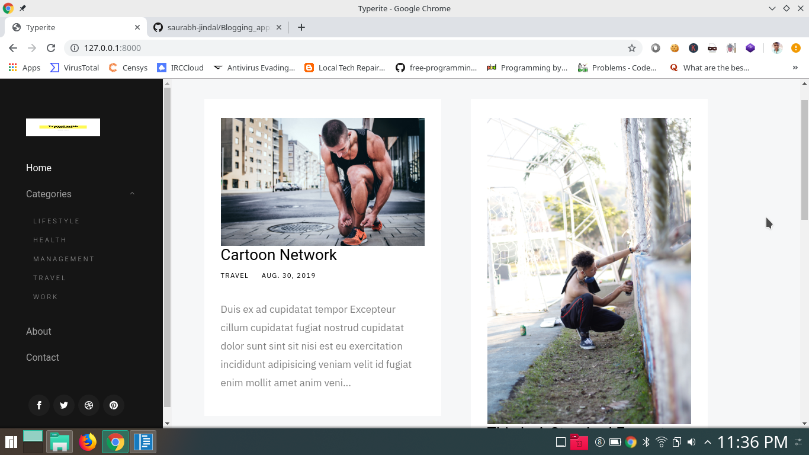

# Blogging_app
* Django medium level app
* Many to go

## Finally converted my Django app in PWA (Progressive Web App)

## Steps to run django server:

* pip install -r requirements.txt
* cd Blogging_app/
* . venv/bin/activate
* cd blogging/
* python manage.py runserver 

